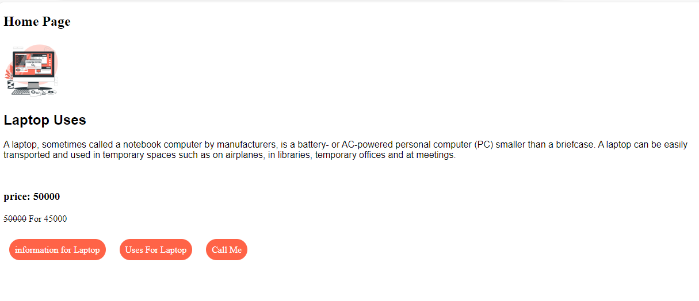
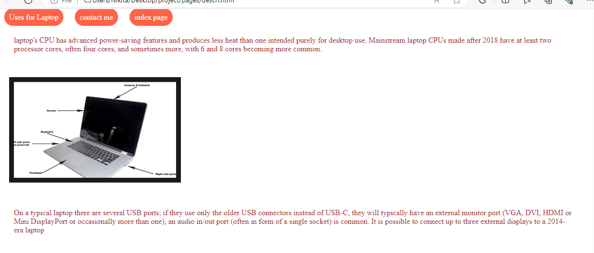

 # Laptop Information.....
Welcome To *Nikita laptop store!*

laptop's CPU has advanced power-saving features and produces less heat than one intended purely for desktop use. Mainstream laptop CPUs made after 2018 have at least two processor cores, often four cores, and sometimes more, with 6 and 8 cores becoming more common.
## WE Offers
- New laptop for 50% discount
- second hand laptop

## Our Vision
To contribute to the community,to create opportunities for the next generation in dance.
To empower individuals and help them to achieve their goals.

## How to join our Store
1. visit our website.  
2. If you want to know more details about course then click on the contact.png
   or Ballet.jpeg
3. For join our classes click on the Call Us button

## Home Page

